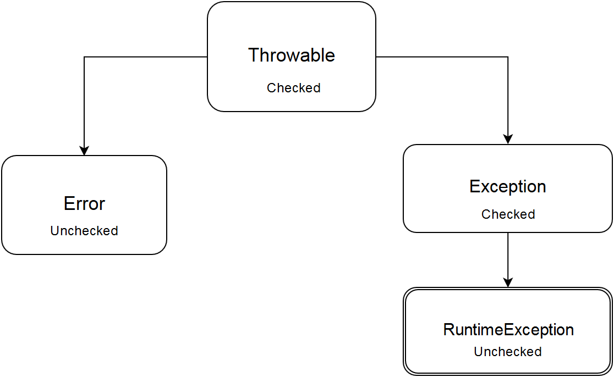

# Assertions

Во время написания кода зачастую необходимо осуществлять валидацию значений параметров.

И о том, какие инструменты предоставляет для этого `Java` пойдёт речь!

## Проблема

Далеко ходить не будем и попросим подняться на эту сцену нашего `Person`-а:

```java
public class Person {
    private int age;
    private String userName;
    private String email;

    public void setAge(int age) {
        this.age = age;
    }

    // getters and setters
}
```

Допустим, совершенно случайно, мы ответственно относимся к данным и всё ещё живём в мире, где отрицательный возраст невозможен.
Но `int` в `Java`, как мы помним, может принимать значения от `-2147483648` до `2147483647`. В `Java` нет возможности объявить безнаковое число.

Что делать?


Знатоки берут минуту на размышление, но мы с вами ответим быстрее: необходимо **валидировать** используемые значения.
Другими словами, нам необходимо перед присваиваеванием проверять: допустимое ли это значение?

Такие проверки, обеспечивающие консистентность данных в методах/классах называются `preconditions`.

> In computer programming, a precondition is a condition or predicate that must always be true just prior to the execution of some section of code or before an operation in a formal specification.
>
> If a precondition is violated, the effect of the section of code becomes undefined and thus may or may not carry out its intended work.

Существуют также и `postconditions`:

> In computer programming, a postcondition is a condition or predicate that must always be true just after the execution of some section of code or after an operation in a formal specification.
>
> Postconditions are sometimes tested using assertions within the code itself. Often, postconditions are simply included in the documentation of the affected section of code.

Более лаконичное определение:

> The precondition statement indicates what
must be true before the function is called.
>
> The postcondition statement indicates what
will be true when the function finishes its
work.

Теперь, когда мы пришли к тому, что проверки нужны, ответим на вопрос: как проверять?

## Проверки

### Assert

В `Java`, начиная с версии `1.4`, существует ключевое слово `assert`, являющиеся унарным оператором.
Данный оператор проверяет истинность выражения и, при не выполнении условия, бросает исключение `java.lang.AssertionError`.

```java
public void connect(Connection connection) {
    assert connection != null;

    // some code
}
```

Соответственно, если будет передан `null`, то будет выброшено исключение.

Разумеется, `assert` можно применять не только для проверки на `null`, а вообще для любого логического выражения:

```java
public void setAge(int age) {
    assert age >= 0 && age < 150;
    this.age = age;
}
```

Таким образом, достигается гарантия, что не валидные данные присвоить будет нельзя.

Однако, я **не** рекомендую использовать `assert`-ы в своей работе.

И вот почему:

#### Механизм `assert` отключён по умолчанию

По умолчанию `assert`-ы в `Java` отключены. Это значит, что пока вы не включите их специальным флагом при запуске приложения  - они будут игнорироваться.

Включается это флагом `-ea` или `-enableassertions`. Также можно указывать конкретные классы/пакеты для которых необходимо включить механизм проверок. Есть антипод: флаг `-da` или `-disableassertions`, эти флаги можно использовать друг с другом для гибкой настройки.

Теоретически, возможно было бы удобно `assert`-ы оставлять включенными во время разработки и тестирования кода, но отключать в релиз-версии. Однако, как по мне, лучше, если проверки работают всегда.

Почему `assert`-ы отключены? Потому что они появились в версии `Java 1.4+` и для обратной совместимости в `JVM` отключены.
Вообще, до версии `Java 1.4` слово `assert` не являлось ключевым и могло быть использовано для наименования переменных, методов и так далее.

То, что `assert`-ы отключены по умолчанию для меня является минусом.
Необходимость постоянно следить за тем включил ты их или нет, как минимум неприятна. По сути, при использовании `assert`-ов, один флаг отделяет вас от того будут ли проверки консистентности данных или нет.
Как по мне - слишком опасно и лишние проблемы на пустом месте.

#### Тип исключения

Как уже было сказано ранее, `assert`, при невыполнении условия, бросает `java.lang.AssertionError`:

```java
/**
 * Thrown to indicate that an assertion has failed.
 *
 * <p>The seven one-argument public constructors provided by this
 * class ensure that the assertion error returned by the invocation:
 * <pre>
 *     new AssertionError(<i>expression</i>)
 * </pre>
 * has as its detail message the <i>string conversion</i> of
 * <i>expression</i> (as defined in section 15.18.1.1 of
 * <cite>The Java&trade; Language Specification</cite>),
 * regardless of the type of <i>expression</i>.
 *
 * @since   1.4
 */
public class AssertionError extends Error {
    // ...
}
```

И, как видите, это наследник `Error`!

Вспоминам гигансткую картинку из раздела про [исключения](../exceptions/exceptions.md):



И представляем иерархию. Понятно, что обработка исключений при использовании `assert` усложняется в разы.
Просто потому, что отреагировать на такое специфическое исключение - сложно.

Это ещё серьёзный камень в огород `assert`-ов.

Получается, что случайно не включить `assert`-ы и лишиться **всех** проверок просто, перехватывать исключения и восстанавливать поток выполнения программы(в случае когда это возможно) после непрохождения проверок сложно.

Исходя из этого, я не использую `assert`-ы в своём коде.

---

**Вопрос**:

Где всё же можно использовать `assert`-ы?

**Ответ**:

Конечно, можно использовать `assert`-ы в критичных местах, руководствуясь тем, что тот, кто вызывает такой код, не должен пытаться перехватывать исключения и восстанавливать поток выполнения программы при не выполнении условия. Т.е для указания неисправимых условий.

Но использовать их в проверках на `null` или валидацию входных значений в метод - плохая задумка.
Просто потому, что для ситуации с передачей неправильных аргументов уже существует `java.lang.IllegalArgumentException`:

```java
/**
 * Thrown to indicate that a method has been passed an illegal or
 * inappropriate argument.
 *
 * @author  unascribed
 * @since   JDK1.0
 */
public class IllegalArgumentException extends RuntimeException {
    // ...
}
```

---

### Explicit checks

И поэтому я отдаю предпочтение **явным** проверкам:

```java
public void setAge(int age) {
    if(age >= 0 && age < 150) {
        throw new IllegalArgumentException("Age can't be less then 0 or higher 150");
    }

    this.age = age;
}
```

Для меня плюсы подобного подхода:

1. Более явно и нельзя по ошибке отключить/не включить/указать не тот пакет и т.д.
2. Я сам выбираю тип исключения, что позволяет мне лучше контролировать поток выполнения программы: проще писать обработчики ошибок, так как `Exception` и потомков легче перехватывать, в отличие от `Error`.
3. Можно реагировать не только бросанием исключения, а, например, присваиванием `default` значения:

    ```java
    // ...
    public static int DEFAULT_TIMEOUT = 0;
    
    // ...
    public void runWithTimeout(int timeout) {
        if(timeout < 0) {
            run(DEFAULT_TIMEOUT);
        }
    }
    ```

#### Preconditions Guava

С учётом того, что `assert`-ы зачастую не любимы `Java` разработчиками, а многословность явных проверок утомляет и иногда делает код более тяжелым к пониманию/прочтению/написанию, было бы наивно ожидать, что не будет написано что-то вспомогательное. Поэтому `preconditions` является частью [Google Guava](https://mvnrepository.com/artifact/com.google.guava/guava).

Поэтому код с явной проверкой:

```java
public static double sqrt(double value) {
   if (value < 0) {
     throw new IllegalArgumentException("input is negative: " + value);
   }
   // calculate square root
 }
```

Может быть переписан более компактно, при использовании `Guava`:

```java
public static double sqrt(double value) {
   checkArgument(value >= 0, "input is negative: %s", value);
   // calculate square root
 }
```

Данная библиотека содержит наиболее часто встречаемые проверки:

1. `checkArgument` - проверка аргумента на выполнение условия. При невыполнении бросается `java.lang.IllegalArgumentException`.
2. `checkElementIndex` - проверка на валидность индекса массива/списка/строки. В противном случае бросается `java.lang.IndexOutOfBoundsException`.
3. `checkNotNull` - проверка на наш любимый `null`. В противном случае бросается `java.lang.NullPointerException`.

Последний является аналогом `Objects.requireNonNull` из стандартной библиотеки.

Использовать `Preconditions` из `Guava` зачастую зависит от команды и проекта, кому-то кажется, что это делает код более лаконичным, с другой стороны тащить только ради этого целую библиотеку в проект спорно(если до этого у вас не было `Guava` в проекте).

Лично мне кажется более читабельным вариант с явными проверками, которые я пишу сам.

## Советы по использованию

И тут, на самом деле, возникает главный вопрос: где проверять?

Разумеется, всё зависит от задачи. Важно понимать, что надо выдержать баланс. Чрезмерное количество проверок во всех возможных и невозможных местах захламаляют кодовую базу и код становится тяжелее понимать, читать и поддерживать(так как изменения параметров, например, добавление новых, надо также будет отображать в валидации). Полное отсутствие валидации приведёт к тому, что у вас будут **неконсистентные** данные.

Проверять данные лучше всего в моменте их получения и присваивания. Если вы получаете данные с какого-то источника и **можете** их провалидировать - сделайте это сразу же, чтобы **дальше** была гарантия консистентности данных, с которыми вы будете работать.

Все `precondition` проверки(такие как проверка аргументов, на `null` и т.д.) должны быть написаны в **начале** метода. Не должно быть никаких проверок аргументов в середине кода метода или конструктора. Ведь иначе не будет гарантии консистентности тех данных, с которыми мы работаем, правда?

Существуют ситуации, когда имеет смысл поставить проверку в конце метода, так называемые `postconditions`.
Например, при вычислении факториала результат **должен** быть больше или равен `1`.

Однако, в реальной жизни я крайне редко вижу использование `postconditions` в коде проекта, а не тестах на код.

## Заключение

При написании кода необходимо осуществлять проверки данных, дабы обеспечить консистентность и обезопасить код.
Для этого в `Java` существует несколько способов:

1. Ключевое слово `assert`.
2. Явные проверки.
3. Библиотеки, предоставляющие наиболее распространённые проверки.

Из всего этого я точно не рекомендовал бы использовать `assert`-ы, по причине того, что они не включены по умолчанию, при невыполнении условия выбрасывают `Error` и неудобны в перехвате исключений.

В своей работе я отдаю предпочтение явным проверкам.

## Полезные ссылки

1. [Assert in java](https://www.baeldung.com/java-assert)
2. [Preconditions and Postconditions](https://medium.com/@mlbors/preconditions-and-postconditions-5913fc0fcdaf)
3. [Preconditions, Postconditions, and Class Invariants](https://docs.oracle.com/cd/E19683-01/806-7930/assert-13/index.html)
4. [Assert. Что это?](https://habr.com/ru/post/141080/)
